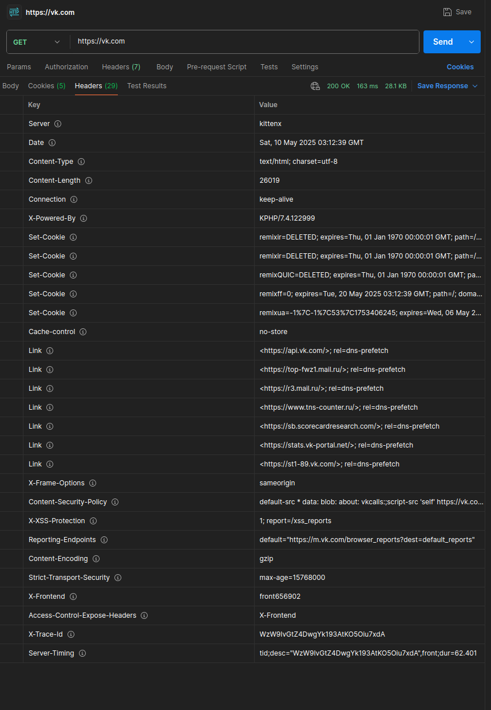
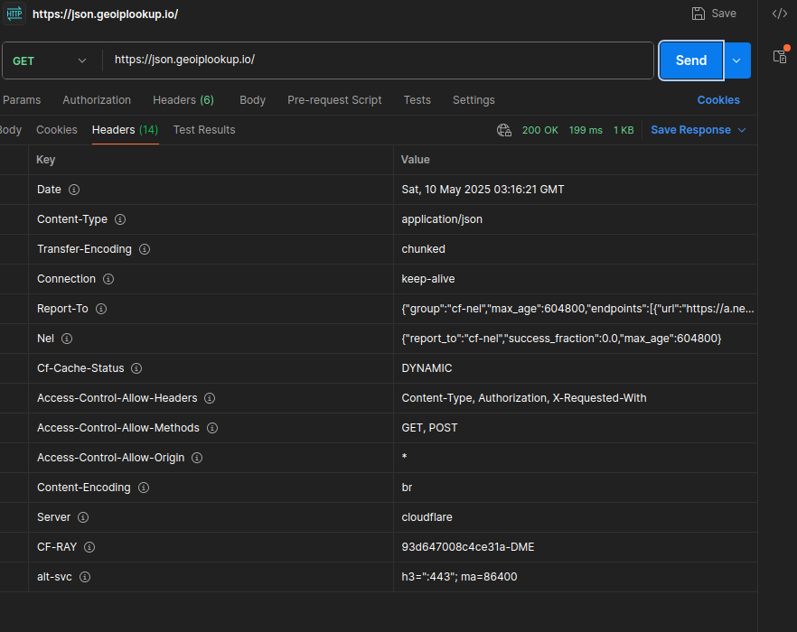

# Task 5 — GET в Postman

1. Запустим Postman.
2. Создаем GET‑запрос на `https://vk.com`:
   - Method: GET
   - URL: https://vk.com
3. Нажмем Send. В ответе обратим внимание на вкладку **Headers**:

Ниже представлен анализ HTTP-ответа на GET-запрос к сайту [vk.com](https://vk.com), выполненного через инструмент тестирования API (например, Postman).

---

## Основные заголовки

- **Server:** `kittenx`  
  Кастомное или замаскированное обозначение серверного ПО.

- **Date:** `Sat, 10 May 2025 03:12:39 GMT`  
  Дата и время генерации ответа сервером.

- **Content-Type:** `text/html; charset=utf-8`  
  Тип содержимого — HTML-страница в кодировке UTF-8.

- **Content-Length:** `26019`  
  Размер тела ответа (26 019 байт).

- **Connection:** `keep-alive`  
  Поддержка постоянного соединения.

- **X-Powered-By:** `KPHP/7.4.122999`  
  Используется KPHP — высокопроизводительная PHP-совместимая платформа от ВКонтакте.

---

## Куки

В ответе установлены или сброшены следующие cookie:

- `remixr=DELETED`  
- `remixff=0` (срок действия до 20 мая 2025)
- `remixua` — вероятно, зашифрованный идентификатор или параметры клиента.

---

## Заголовки безопасности

- **Cache-Control:** `no-store`  
  Запрещено хранение ответа в кеше.

- **Strict-Transport-Security:** `max-age=15768000`  
  Включён HSTS на ~6 месяцев, обязует использовать только HTTPS.

- **X-Frame-Options:** `sameorigin`  
  Запрет отображения сайта во фреймах других доменов.

- **Content-Security-Policy:**  
  Указывает разрешённые источники контента (в т.ч. blob, vkcalls, скрипты с vk.com).

- **X-XSS-Protection:** `1; report=/xss_reports`  
  Включена защита от XSS и отчёты об атаках.

- **Reporting-Endpoints:**  
  Отчёты об ошибках отправляются на `https://m.vk.com/browser_reports`.

---

## Оптимизация и производительность

- **Content-Encoding:** `gzip`  
  Ответ сжат.

- **Link:** prefetch DNS-запросов к сторонним ресурсам (например, api.vk.com, mail.ru, tns-counter.ru).

- **X-Frontend:** `front656902`  
  Идентификатор фронтенд-сервера.

- **Access-Control-Expose-Headers:** `X-Frontend`  
  Разрешённое раскрытие заголовка `X-Frontend` клиентам.

- **X-Trace-Id / Server-Timing:**  
  Уникальный ID запроса и информация о времени обработки.

---

## Важное замечание

В ответе **отсутствует заголовок `Access-Control-Allow-Origin`**.  
Это значит, что сервер по умолчанию **не разрешает выполнение кросс-доменных запросов** из браузеров (CORS).  
Такая политика обеспечивает дополнительную защиту от неавторизованного доступа со сторонних сайтов, но может потребовать настройки, если API предполагается использовать публично.

---

4. Создаем второй GET‑запрос на `https://json.geoiplookup.io/`:

Ниже приведён анализ HTTP-ответа на GET-запрос к [json.geoiplookup.io](https://json.geoiplookup.io/), выполненного через Postman.

---

## Основные заголовки

- **Date:** `Sat, 10 May 2025 03:16:21 GMT`  
  Дата и время отправки ответа сервером.

- **Content-Type:** `application/json`  
  Тип содержимого — JSON-данные.

- **Transfer-Encoding:** `chunked`  
  Данные передаются частями (chunked transfer encoding).

- **Connection:** `keep-alive`  
  Соединение остаётся открытым для последующих запросов.

- **Content-Encoding:** `br`  
  Ответ сжат с помощью Brotli-алгоритма.

- **Server:** `cloudflare`  
  Запрос обработан через сеть доставки контента (CDN) Cloudflare.

---

## Заголовки безопасности и CORS

- **Access-Control-Allow-Headers:** `Content-Type, Authorization, X-Requested-With`  
  Разрешённые заголовки для CORS-запросов.

- **Access-Control-Allow-Methods:** `GET, POST`  
  Разрешённые HTTP-методы.

- **Access-Control-Allow-Origin:** `*`  
  Разрешён доступ из любых источников (открытый CORS).

---

## Кастомные заголовки

- **Report-To:**  
  Содержит настройки отчётности о сетевых ошибках, отправляемые в Cloudflare.

- **Nel:**  
  Содержит политику отчётности Network Error Logging.

- **Cf-Cache-Status:** `DYNAMIC`  
  Данные формируются динамически, не из кэша Cloudflare.

- **CF-RAY:** `93d647008c4ce31a-DME`  
  Уникальный идентификатор запроса, используемый Cloudflare для трассировки.

- **alt-svc:** `h3=":433";ma=86400`  
  Поддержка альтернативных сервисов, например, HTTP/3.

---

## Важное замечание

В ответе **присутствует заголовок `Access-Control-Allow-Origin: *`**,  
что означает: **сервер разрешает кросс-доменные запросы (CORS) со всех доменов**.  
Это даёт возможность использовать API публично из браузерных приложений и сторонних сайтов,  
но одновременно повышает риски, если доступ не ограничен авторизацией.

---
