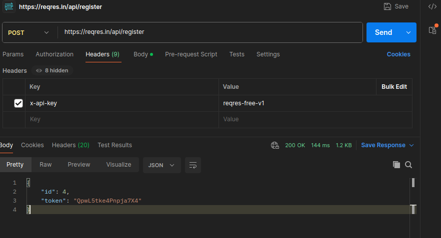
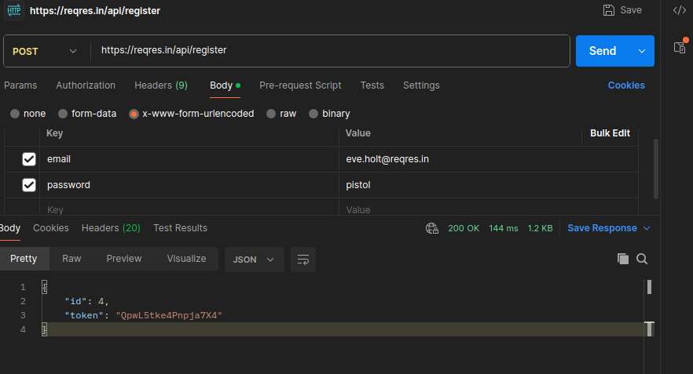

# Task 6 — POST /api/register (reqres.in)

1. Создаем POST‑запрос:
   - URL: https://reqres.in/api/register
   - Headers
   
     - `Key`: x-api-key
     - `Value`: reqres-free-v1
   - Body → x‑www‑form-urlencoded
   
     - `email`: eve.holt@reqres.in
     - `password`: pistol
2. Send. Увидим JSON:
   ```json
   {
     "id": 4,
     "token": "QpwL5tke4Pnpja7X4"
   }