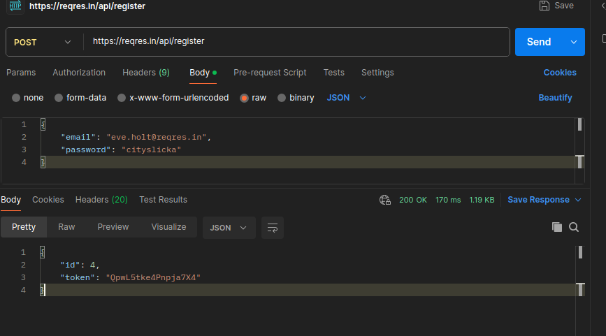

# Task 7 — POST /api/login (reqres.in)

1. Создаем POST‑запрос:

   - URL: https://reqres.in/api/login
   - Body → raw → JSON
     ```json
     {
       "email": "eve.holt@reqres.in",
       "password": "cityslicka"
     }
     ```
2. Send. Увидим:
   ```json
   {
     "id": 4,
     "token": "QpwL5tke4Pnpja7X4"
   }
   ```